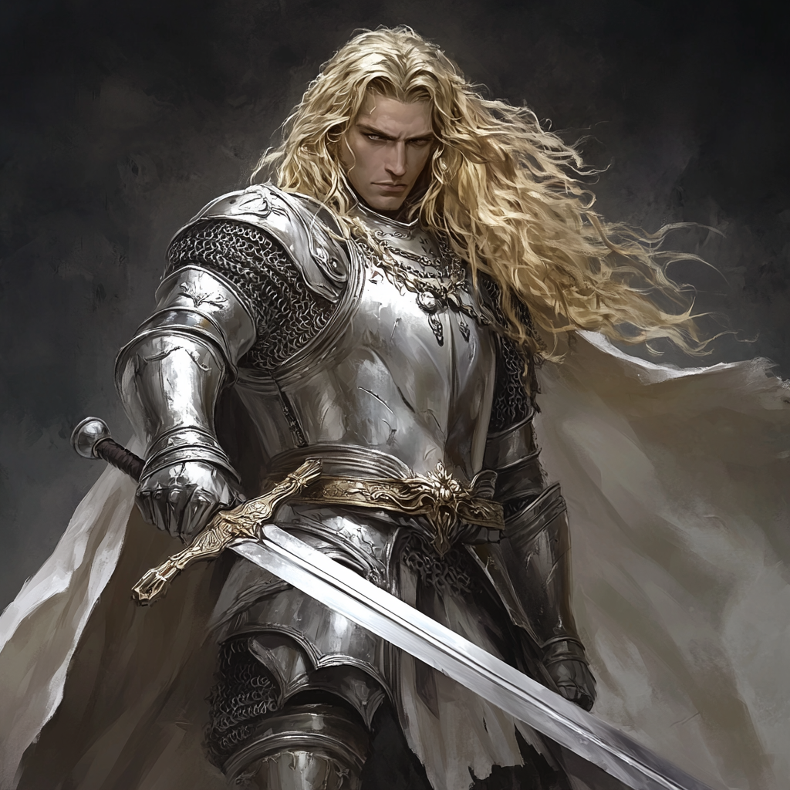
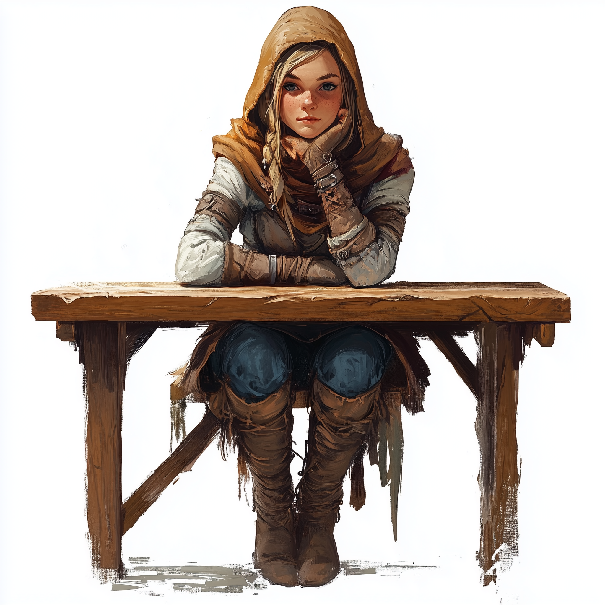
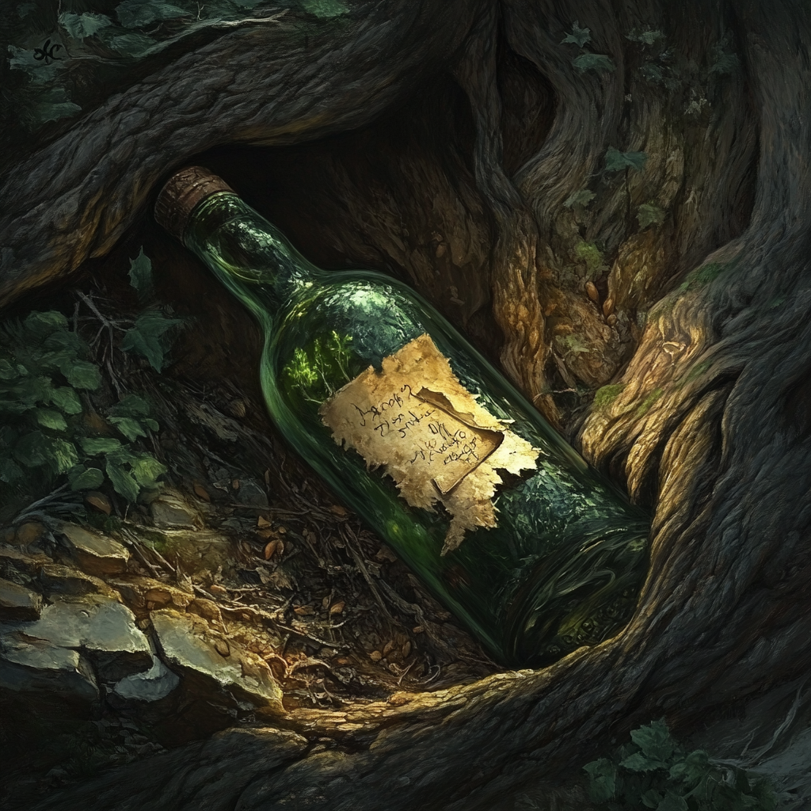
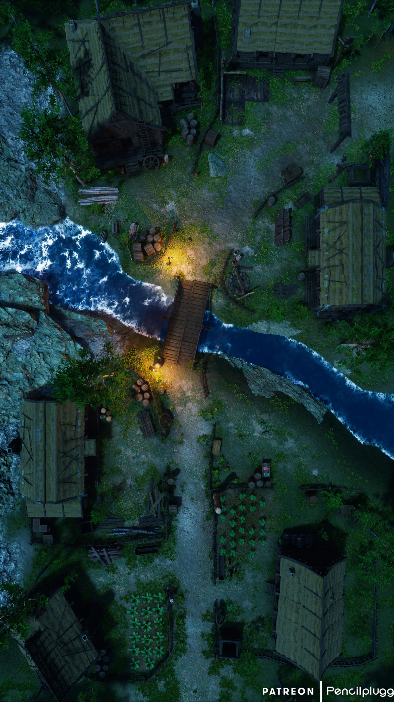
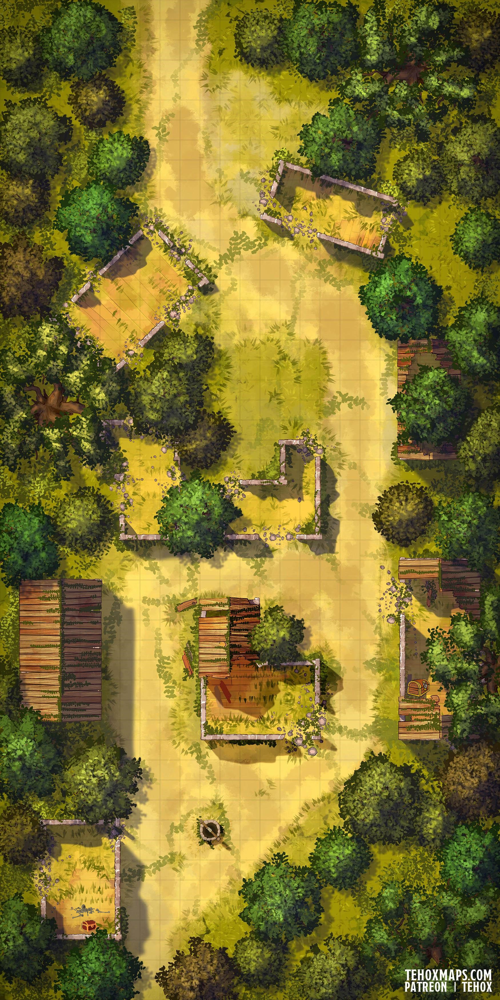
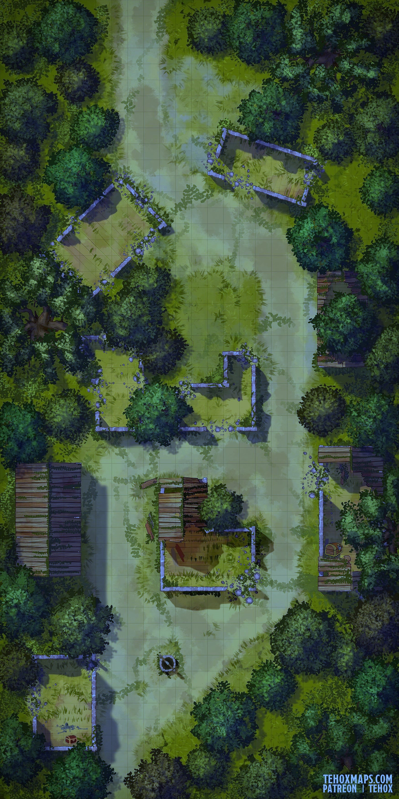
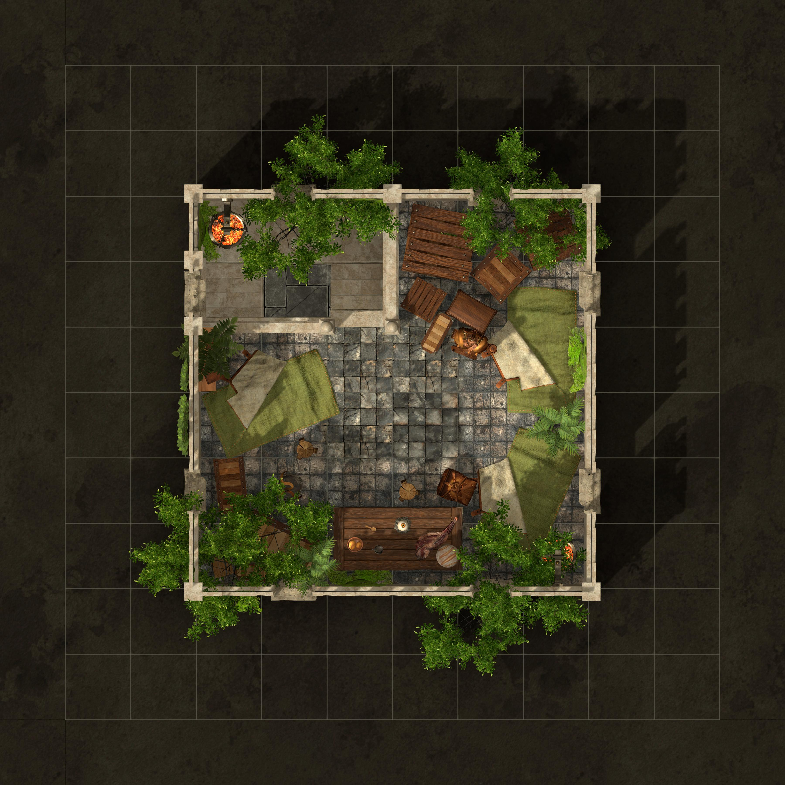
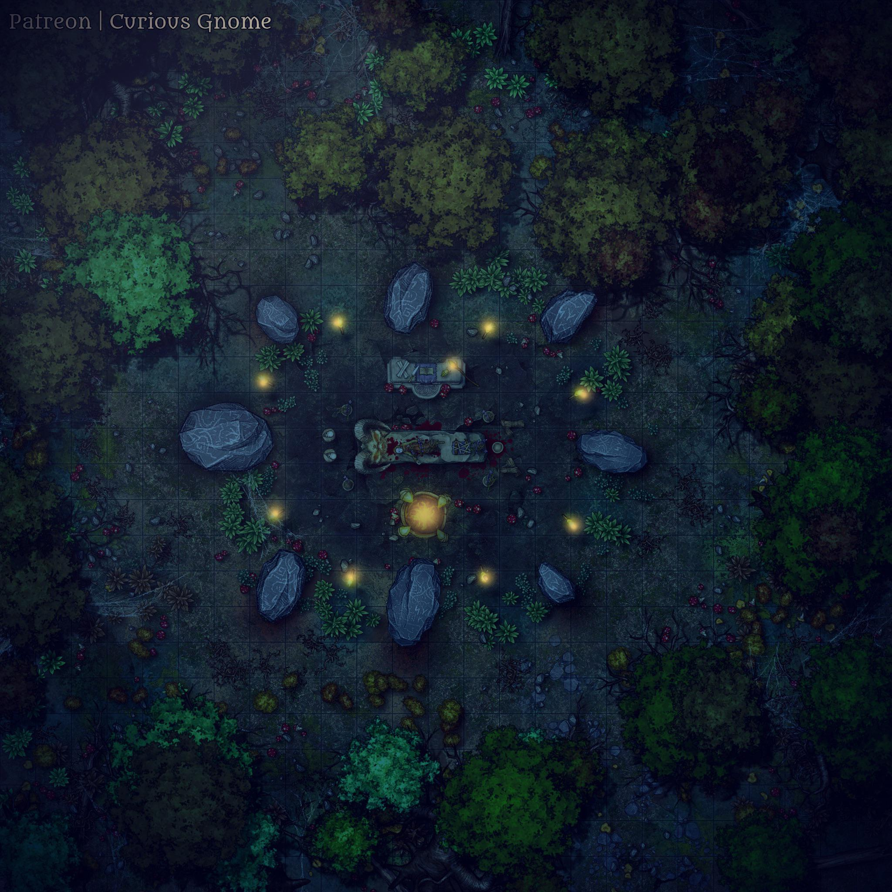

# Contents

[Overview](#overview)

[Chapter 1. Prologue. Following the Echoes](#prologue)

[Chapter 2. Major Locations and Events](#major-locations-and-events)
- [Abandoned Village](#abandoned-village)
- [Crypt of Sehanine](#crypt-of-sehanine)
- [Mansion Gate](#mansion-gate)
- [Sunrise Keep](#sunrise-keep)
- [Temple of Corellon Larethian](#temple-of-corellon-larethian)
- [Watchtower](#watchtower)

[Chapter 3. Minor Locations and Events](#minor-locations-and-events)
1.  [Bottled Surprise](#bottled-surprise)
2.  [Chapel Ruins](#chapel-ruins)
3.  [Graveyard](#graveyard)
4.  [Hunting Spot](#hunting-spot)
5.  [Lonely Grave](#lonely-grave)
6.  [Ritual Site](#ritual-site)
7.  [Secret Cave](#secret-cave)
8.  [Unfortunate Vilager](#unfortunate-villager)
9.  [Willow Wisp](#willow-wisp)
10.  [Yuan-Ti Scouts](#yuan-ti-Scouts)

[Chapter 4. Finale. Revelation.](#finale)

[Appendix A. Stat Blocks](#appendix-a-stat-blocks)

[Appendix B. Items](#appendix-b-items)

[Appendix C. Decision Tables](#appendix-c-decision-tables)

[Appendix D. Maps](#appendix-d-maps)

# Overview

For the last century, this part of the Reaching Woods was avoided by common folks and seasoned adventurers alike. Stray undead hordes and packs of mutated animals can scare off even well-trained paladins of Elturgard, and those who dare to enter the fog come back changed, losing their minds and shortly going insane, IF they come back, even. This drow, Seimur, is saying he _"found a safe way to travel the Wood of Echoes, and needs your company to enter long-lost land and uncover it's secrets. For quite some gold, of course."_ Do you really trust him? Hell no. Do you need gold? Hell yes! Besides, you are always up to an adventure. Let's just hope it won't be your last...

This campaign is designed for a party of 4-5 characters of level 7, and offers multiple opportunities to level up individual characters.

Suggested changes to RAW: 1) Reading a spell does not require having appropriate spell slot available (still, character should have it in a spellbook for one of it's classes)

# Prologue

_Lucky Steps Inn_

Background: all characters were approached by Seimur separately, prior to adventure start, and all he said in the end is "Lucky Steps, after dusk, last day of this week".

## Arrival at Lucky Steps Inn

_Seimur_

The adventure starts when characters one by one arrive at Lucky Steps inn, a meeting point mentioned by elf. When they arrive, read the following:

_TO DO: Lucky Steps flavour text_

Inside they will find half-empty tavern hall, where innkeeper will point to a table besides the counter, where Seimur sits, covering his face with a cape, to remain unrecognised. Seimur will greet characters one by one, and when everyone arrives, he suggests that adventurers introduce themselves. In the end, he will describe himself as a lone traveller, who happened to get hands on an ancient elven writings describing forbidden rituals, how to create barriers, illusions and charms, and also how to resist this kind of magic.

He bevieves some of the magic resembles such in the Wood of Echoes, and if it was used, elves of the past wanted to hide something exteremely valuable. He wanted to do the job with his brother Dairon, but, unfortunately, Dairon thinks it's too risky and not worth a shot, so Seimur decided to look for help elsewhere (WIS (Insight) check DC 18 reveals that Seimur is hiding something. Maybe he doesn't want to scare you off just like his brother?). He is glad that some experinced adventurers were interested in this endeavour. At the end, he says, that he got an old map of the place, and paid and artifacter to create a magical item which will help all of them to travel safely through the fog. One more thing, he needs to get his chronometer back from local gang.

He points at another table in the opposite corner, where a company of five men is drinking beer and playing dice. He needed some money to prepare for the quest, and there was no choice other than selling his father's pocket watch to these Singing Rats, but when he wanted to get the relic back, Rats asked for triple the price. Their leader, Piper, is in the posession of the named watch. Would the party help Seimur retrieve the memory?

Here DM by Seimur's name will try to convince players to retrieve the family watch (success will have an impact during the main part of the adventure). If players disagree despite the effort, go to a long rest and skip the Singing Rats confrontation.

## Confronting the Singing Rats

_Singing Rats_

_Piper_

Players approach the table, where the band is loudly shouting. The leader, Piper, is not playing or drinking, he is sitting separately, watching the party, but doesn't join. When players approaches him, he commands the rest of the goons to leave the place. After a moment, there is only him, three memebers of the gang, and player characters that are left in the tavern hall. He offers to buy out the watch for 500G, but eventually players can discover other options listed below:

|Challenge|Goal|Success|Failure
|---|---|---|---|
|Buy Out|500G|Piper returns the watch|Piper refuses to return the watch, but leaves other options open|
|Play the Dice|(A)DEX (Sleight of Hand) check DC 25 OR (B) WIS (Perception) check DC 15 (by a character who knows Thieves' Cant) AND DEX (Sleight of Hand) check DC 15|Piper returns the watch; if caught cheating, Rats force the fight later|Piper refuses to return the watch, and demands 200G; if caught cheating or players refuse to pay, Rats force the fight later|
|Arm Wrestle|STR (Athletics) check DC 20 with disadvantage|Piper returns the watch|Piper refuses to return the watch, and demands 200G; if players refuse to pay, Rats force the fight later|
|Duel Proposition|CHA (Persuasion) check DC 20; character shouldn't have Extra Attack feature|Piper agrees to honest duel with the character who convinced him, outside of the tavern|Piper seemingly agrees to a duel; Rats force the fight later|
|Duel|Reduce his HP to 0; spells are prohibited|Piper is furious after loss and commands his bandits to attack you, but he lost their respect, and forced to return the watch|Piper refuses to return the watch and demands 500G from other characters; if players refuse to pay, Rats force the fight|

If players are able to retrieve the watch, Seimur is happily asking them to get outside for a second to discuss the plan for tomorrow: you rest in the inn, next morning he takes the cabin to the edge of the wood, then you walk two miles until reaching the fog. Here he will activate the artifact, and lead the party to an ancient keep, where they should retrieve something valuable.

When players head back to the tavern, they are met by Piper and three of his goons, in case fight was triggered previously (except for Duel scenario). He walks up to the character who did the trigger action, say that he is admiring character's skills, and at that moment character is attacked by one of the bandits hiding in the bushes. This is ranged sneak attack made with +6 bonus and advantage, dealing 1d8 + 3 + 4d6 Piercing damage. Piper comments the result, and draws his dagger, starting the fight. Seimur joins the adventurers, facing three Bandits (crossbow), two Bandits (knife), one Berserker and Piper himself.

All bandits drop their weapons and armor, and 600G in total, Piper drops dagger +1 and possibly watch. After the fight, Seimur will thank you and offer a night in the tavern at his expense. Do a long rest over the night and continue the adventure.

There will be one more chance to get the watch, if players didn't get it before and didn't trigger the fight, by pickpocketing drunk Piper, DEX (Sleight of Hand) check DC18 (distraction gives an advantage), on the 2nd floor of the tavern before going to sleep.

## Road to the Wood of Echoes

In the morning, your travels begin. Seimur greets the party and invites to enter the cart. The cab rides for about 3-4 hours before stumbling over Elturgard knights patrolling the area. The group consists of three Vengeance paladins, their squires and one priest of Lathander. Seeing them, Seimur will hide his head under the hood and try to remain silent.

_Elthurgard patrol_

One of the paladins starts asking questions about the intent, because adventurers approaching Elturgard border. Shortly, another paladin will seemingly recognize Seimur, and claim that elf stole his purse. Group can try to talk their way out of the situation, or fight the patrol. Knights drop their armor and weapons, and 200G.

Either way, when party continues travelling, Seimur will break the silence and thank adveturers for saving him once again. Party can persuade him into admitting that he in fact stole his purse, because said palading wasn't acting nicely towards common folk. Several hours later, party arrive at the edge of the wood. Read this:

_TO DO: Wood of Echoes flavour text_

_Wood of Echoes_

Cart leaves you at the last crossroad, and Seimur puts his backpack on the ground. He gets the map, consults it for a minute, and points the direction. Then he gets strange lantern, says a spell and it lights up with the blue color. Drow is ready to enter the fog.

Here it is recommended to complete a short rest if party fought Elturgard patrol. Then continue the adventure by traveling to Sunrise Keep.

# Major Locations and Events

This chapter contains descriptions for all the major locations in the Wood of Echoes. As mentioned at the end of Prologue, party first enters Sunrise Keep, and then will travel across the map to other destinations. Map of the wood is found in appendix D, players will get access to it at the end of Sunrise Keep arc. It is split into hexagonal tiles, moving from tile to tile takes around 30 minutes and equals 1 mile travel. When party arrive at a tile for the first time, they either find Major location, which are pre-determined but hidden from the players, or encounter Minor location or event, which can be rearranged and reassigned to uncovered tiles before the session. All characters have to move on global map as one group, since they have only one Fey Lantern which allows for safe travel. This limitation is lifted on local maps.

Additionally, if in prologue party was able to return the pocket watch, after completing Sunrise Keep arc they will have access to the in-game time tracker. DM decides how it should look like. Sun is rising at 6AM and setting at 8PM, and time of day determines the level of danger during exploration and rests. Appendix D contains different maps for night and day scenarios, Appendix C contains decision tables which can help to determine outcome of repeating events.

## Abandoned Village

### Arriving at Abandoned Village

_Abandoned Village_

When players first arrive at Abandoned Village, read this:

_TO DO:_

After passing the first house, group is attacked by a pack of six fey wolves and one shadow wolf. If fight is not over in one round, Renvel will come to help at the start of round two. Then he will talk to adventurers and ask them to meet him at a house later. In fight is over in one round, he won't appear, instead group will meet him only when stumbling across his house.

_Renvel_

### Discovering Abandoned Village

Abandoned Village has the following points of interest.

Renvel's House, good condition, west part of the village. Renvel lives there. Will meet the group and offer a shelter, maybe some resources.

Well, center of the village. WIS (Perception) check DC10 will help to find a clover leaf cut on one of the bricks. Toss 1G to get heroic inspiration, only works once a day. On the bottom, 100G can be found, but going down prevents party from getting heroic inspiration.

Merchant's house, east part of the village, poor condition. Locked chest (DC15) contains 800G.

House of Derek and Maya, ruined, south. Has a diary page written by Maya and Flower Ornated Lockbox (DC25 or Flower Ornated Key, found randomly in the Wood of Echoes). Note says the following:

>_I was dreaming about leaving the village since my childhood. How lucky I am to have Derek! He promised to take me to Baldur's Gate at the next full moon, and I'm so excited! Can't wait for him coming back from the hunt, and we'll start packing together._

Inside the lockbox, Pearl of Power is found. Lockbox is charmed, so that it will break if verbal spell is cast directly onto it, crushing the pearl (like Knock).

Buried treasure chest, under the ground in north-west house remains. Inside the chest, 1000G can be found. Hint for finding the chest can be found in random event ???.

### Renvel's Fate

After finding Renvel in his house, he tells that he is living here in wilderness so nobody is bothered by his appearance, since he's a shapeshifter. At the edge of the wood noone is risking to seek for him, so he can safely live, hunt small animals and provide for himself. He suggests a party to stay for the night, and restock, giving each party member a daily ration for the night.

In the morning, a group of paladins arrives, led by handsome blonde man with shining sword, who introduces as Damian, Crusader of Torm and will of Elturgard. He is here to find Renvel, and bring him to justice for being a monster. Players can side with Renvel, triggering the fight against the whole group, or give him out. Paladins execute him in place, and if anyone of the paladin group from prologue survived, Damian will comment that we helped to cover up another criminal earlier and force the fight anyway.

_Damian, Crusader of Torm_

All enemies drop weapons and armor, Damian has Flame Tongue Longsword.

After the fight, if Renvel survived, he says it's too dangerous to stay here any longer and planning to leave. Before that, he says he could train someone from the group to become more efficient in battle and surviving in wilderness, granting a level up to a character who is still level 7.

Additionally, if party is not full, he can join the group as level 7 Barbarian, Path of the Beast, Shifter, Outlander.

## Crypt of Sehanine

### Opening the Way

_Statue of Sehanine_

When players first arrive at the statue, read this:

_TO DO_

Sacrificing a spell slot or casting Detect Magic or similar spell will cause the mysterious voice say the following lines:

>Храню вечный покой  
Всех тех кто здесь уснет  
Лишь в свете утренней звезды  
Откроется проход

Placing Rusty Morning Star in the hand of a statue will turn it into Slumbering Morning Star, make water level drop and reveal a secret undergound passage to a crypt. If held by a Fey, morning star will automatically levitate and place itself in the hands of the statue, turning into Slumbering Morning Star, opening the way and then come back to character hands. Other races should retrieve the weapon by hand. Party should go down in order to continue the adventure.

### Discovering Crypt of Sehanine

_Entrance to the crypt of Sehanine_

Crypt has the following parts.

Main burial chamber, south part. First big room in the crypt, has several tombs in it. Disturbing the dead will summon ghosts for a fight. Inside 400G can be found.

Lord's burial chamber, east part. Locked by stone door. Has Sentinel Shield laying on the stone tomb, touching it triggers a fight with two ghosts and three skeleton lords.

Worshipers room, central part. Has a statue of a man closing his eye, like trying to hide from a light. Sacrificing a spell slot or casting Detect Magic or similar spell will cause the voice say the following lines:

>О, Странник  
Что несет нам свет  
Зажги звезду  
И пред Судьей держи ответ

After illuminating the statue with Slumbering Morning Star, the blue barrier will disappear and weapon will turn into the Awakened Morning Star.

Treasure room, south-west part. Opening the locked door triggers Cloudkill trap. Has a total of 5000G in treasures, but looting it will force the fight with the Judge later.

Hall of Trials, north part. Final trial will happen here.

### Final Trial

_The Judge_

When party enters hall of trial, they will see a mysterious figure in a cloak, holding a staff. He introduces as a Judge, and begins a trial. If party (1) has an Elf or another Fey character, who is (2) holding the Awakened Morning Star and (3)Neutral- or Good-aligned, and (4) party didn't touch the treasury, Judge will threat him as worthy and simply disappear, saying "One last step, Wanderer...". On the same place, lord's note will fly down to the floor with the following text:

>This is it. My daughter is going to marry this man. I am happy for her and angry at myself at the same time. He doesn't even carry Fey blood, but I guess, it doesn't matter. All I care about is a true Heir. If she will carry a boy, I can forgive her anything. Although, can I forgive myself?

If at least one condition is not met, he will animate two petrified archers and four swordsmen in the hall, starting a boss fight and locking the entrance with a force barrier. Killing the Judge will make him disappear and drop the same note.

After the fight, party can examine the far wall of the room, where two statue and one empty pedestal reside. Sacrificing a spell slot or casting Detect Magic or similar spell and touching one of the pedestals will cause the voice convince the caster to touch one of the objects.

If white statue is touched:
>Заветный дар  
В обьятьях твоих рук  
Верши последний шаг  
Избавь Наследника от мук

If black statue is touched:
>В ночи без звезд  
Нам править суждено  
Когда погаснет свет  
И превратится кровь врагов в вино

If empty pedestal is touched:
>Наследник не достоин  
Хоть верил до конца  
Верни же ты на место дар  
Не быть ему в руках лжеца

Depending on the starbearer choice, Awaken Morning Star will transform differently. If white statue was illuminated, hall lights with starlight, and Radiant Morning Star returns to the bearer. If black statue was illuminated, hall lights with bloodlight, and Corrupted Morning Star returns to the bearer. If bearer choses to place it on the empty pedestal instead, invisible force will shatter the weapon, diming all the lights, and leaving only tiny Shard of the Morning Star gleaming with light.

All the variations of Morning Star require attunement to activate magical properties, and count as a Gift requred to enter the final chapter. Also, starbearer will receive a level up (or another character, if starbearer is already level 8).

## Mansion Gate

### Arriving at the Gate

_Mansion gate overgrown by fungus_

When party first arrive at the Gate, read this:

_TO DO:_

Before the gate, players see young female elf sitting on her knees and whispering. When she notices the party, she will start the dialogue, and once assured that there is no treat, introduce herself as Anariet, Springwarden, first circle druid of the Emerald Enclave.

_Anariet, Springwarden of the Emerald Enclave_

She will tell that her order is hiding information about this part of wood, despite what's happening, and young druid decided to act on her own. She created magic necklace, which allows to travel the fog, and started exploring the woods. Local dangers are too much for the youngster, but still she was able to discover this gate, which is covered by fungi saplings and tentacles. Additionally, some kind of abjuration magic is present here. All she was able to discover is an entrance to a fungal cave not far from here, but it seems too dangerous to dive in alone.

Anariet asks adventurers to aid her in exploring the cave which connected to these mushrooms blocking the gate, in return offering nature's blessing. Then she shows the way to the cave (30 minutes of travel).

### Discovering Fungal Cave

_Fungal cave_

When party first arrives at Fungal Cave, read this:

_TO DO:_

Fungal Cave has the following points of interest.

Infested remains, south-east part. Inspecting them triggers the fight with one fungi abomination, four fungi hunters and three fungal zombies. Zombies can be looted for Guardian Emblem.

Treasure chest, it the river, east part. Contains 400G, Potion of Healing (2), Potion of Clairvoyance and a servant's note with the following text:

>I don't like what's happening here, at the lord's house. Everyone is getting suspicious, gossiping about his daughter. I am planning to leave soon, but before that, I have to hide my belongings somewhere safe.

Wooden bridge, center of the map. D20 roll determines if it breaks or not.

Narrow passage, north part. Having light sources will trigger fight with four fungal bats.

Fungal lair, north-west part. Coming close or attacking the mushrooms will lead to the fight with one fungal tyrant, three abominations and five hunters. Slaying every single enemy will remove the overgrowing tentacles at the Mansion Gate. After the fight, Anariet will offer the party to come with her to Mansion Gate or join her later.

### Opening the Gate

When party is back to the gate, they see no signs of infestation. Anariet thanks hearoes for help, and says that gate is still closed. She returns back home for a while, since her powers are limited, but before that she gives nature blessing to one of the adventurers, granting a level up (if the character is still level 7). If for some reason party is not full, they can persuade her into helping them. She will join the party as level 7 Druid, Circle of the Stars, High Elf, Acolyte.

After she leaves or stays, party can approach the gate. If they haven't acquired neither Awakened Morning Star (or Corrupted Morning Star/Shard of Morning Star, depending on the choice made in the end of Crypt of Sehanine story arc) nor ???, nothing will happen. Attempts to bypass the barrier will result in taking 1d10 Force damage and falling prone. If at least one item is present, mysterious voice says "Wonderers, present the Gifts". If only one item is presented, voice says "Two Gifts for the Heir". If both are presented, voice says "The Heir awaits you", lifts the barrier and opens the gate.

This is a no return point. After passing the gate, door behind will be closed and party will enter the final part of the adventure. Continue the adventure as described in Chapter 4.

## Sunrise Keep

### Arriving to Sunrise Keep

_Sunrise keep_

When party first arrives to Sunrise Keep, read this:

_TO DO:_

Seimur points to the tower and says that he probably needs to get there.

### Ground Level

Ground level contains the following parts.

Keep Entrance - small room connected to inner court.

Inner court - big open location connected to entrance, stables, chapel and main hallway (blocked from the other side).

Stables - contain locked chest (DC18) with Potion of Healing (2). Attempt to pick the lock or investigate bones starts a fight with three Bonemares.

Chapel - small chapel of Torm, containing secret passage to treasury, hidden underneath the fountain with armed gauntlet (WIS (Perception) check DC15 required to open path). Seimur will comment on this, if still alive.

Main hallway - location connected to inner court, armory, living room, kitchen and dining room. Also has stairs leading to underground level and to guard tower (Seimur will run upstairs and wait for midnight once party reaches this location).

Armory - equipment storage, where party can find Smithing Tools and the following rusted weapons: dagger, light hammer, shorsword, mace, rapier, warhammer, morning star (key item), longsword, spear, halberd, greataxe, lance and greatsword. Also contains two chests with Arrows (40) and Crossbow bolts (40).

Living room - room filled with human bones connected to private room. Attempt to open the door will trigger the fight with one Skeleton Lord and six Skeleton Warriors.

Private room - connected to bathroom. Party can find letter written for commander, talking about their mission to protect the Gift.

>Commander Aliott,

>I hope you understand that this assignment is much more important than anything I asked from you for the last ten years of service. When full moon enters the sky, bring the Heir's Gift to the Judge and let him do his job. And remember: noone should find out where we hide it for now. Not a single soul.

>Lord Eavalur 

Bathroom - ???

Kitchen - party can find 1d4 Rations.

Dining room - party can find 1d4 Silver Chalices.

### Underground Level

Underground level contains the following parts.

Underground hall - room with statues connected to cells, small cave and library. When party passes after triggering any of the secret doors, fight with 6 animated statues will trigger.

Cells - room with eight prison cells, north-east one has broken door and a note from prisoner saying:

>I know, the Star is hidden somewhere here, within the keep walls. If only I would be more lucky and didn't get caught! Whatever, when they dragged me to my cell I noticed cracks in one of the walls, must be some sort of cavern or underground pass. I think it's possible to crack the cell door with a stone, take a couple of brick from the wall to make it collapse and slip away. Let's just wait for the night...

Small cave - hall in the wall leads to a cave filled with luminescent fungi. Under the fallen rock party can find crushed skeleton and Ring of Protection. Retrieveing the ring will trigger the fight with four fungi hunters and one fungi abomination.

Library - has a secret door to treasury (WIS (Perceprtion) DC 18).

Treasury - contains 5000G worth of valuables in total and Amulet of the Devout +1. Amulet lies on a pedestal, and lifting it will trigger magic trap dealing everyone who can see it 4d8 Radiant damage (WIS (Perception) check DC20 to spot, can be deactivated only by dispelling magic from the pedestal). Connected to library, also can be reached from chapel but cannot return back.

### Meeting Neshat

_Night sky_

After failing to understand anything about the stars, Seimur is disappointed and runs downstairs to the inner court, shouting about all it. When you meet him there, first he rants about their failure and ask about other ideas. Here, flaming figure appears called Neshat (INT (Arcane) check DC15 will help recognize her as Yfreete, any Warlock will succeed automatically).

_Neshat_

She introduces herself, then complains about Seimur receiveing her help and knowledge about elven magic in this place, and accuses him of not fulfilling his agreement in two weeks as promised; after the dialogue burns his body to death. If party already picked up the rusted morning star, she says something like "Oh, I ALREADY see you are more capable than this worm". Either way she offers a pact to a non-Warlock. If one of the adventurers agrees, they receive one level of Warlock, The Genie (Yfreete), and if required, a hint "Why don't you look for the star somewhere else? Maybe not in the sky?". Burnt Seimur's skull works as a Genie essense. "As a reminder about my generousity", she says. Also, once per adventure, before pact keeper dies, she will save him from the battlefield by transporting into demiplane where mephit servants will fully patch him and send back to his party in 8 hours.

In exchange, she asks players to find and kill one of her kind, who helped to corrupt this place. She gives the same amount of time, two weeks, to fulfill the contract.

Seimur drops 400G, Studded Leather, Cloak of Protection, Shortsword +1, Potion of Greater Healing, Ancient Map, Fey Lantern, and, if retrieved in prologue, Family Pocket Watch.

At this point, it is recommended to get the morning star, complete a long rest and start exploring the map.

## Temple of Corellon Larethian

### Arriving at the Temple

_Temple of Corellon Larethian_

When players firs arrive at the Temple, read this:

_TO DO_

When they pass the gates

### Discovering Temple

Temple has the following locations.

Entrance, south part.

Chapel, east part. Has a Ring of Mind Shielding laying on the pedestal. Taking this ring will trigger fight against ghosts/undeads. Attuning to this ring will reveal that it is inhabited by the spirit of lady Tinuviel, wife of lord Eavalur. She will talk in Elvish, revealing her name, her past of being not welcome by her husband for giving a birth to a daughter. She was praying for her dead friend Quenya, when something killed her, and her spirit was locked in the ring only knowing darkness and emptyness since. She will ask the party to check on the tree she planted on the graveyard as a part of ritual to honor Quenya's memory. Then she promises to show the way to the second gift.

Treasure room, east part, behind the secret door DC20. Contains 4000G in treasures.

Graveyard, west part. Has a giant oak growing among the graves, and a lot of daisies near it's roots. If someone is wearing the Ring of Mind Shielding, the lady will try to take one of the flowers by character's hand (CHA saving throw DC20 to resist). If character touches the flowers, ghosts and undead will appear. After the interaction, lady will say "Gift is hidden beneath the foot of The Protector, but beware those who sworn to him".

_Great oak_

Main hall, north part. Statues of two elven warriors and Corellon Larethian himself located here. Serves as an arena for Divine Twins fight.

### Divine Twins

_Dancing Sun, twin-protector_

_Silent Moon, twin-protector_

When party enters the main hall after fulfilling lady's request, they will see a spectral figure bending a knee in front of Corellian statue. If stranger notices the party, he turns arond facing them, then two flaming curved swords appear in his hands. At the same time, two companion statues come to life. Also, behind one of the columns another figure will appear, an elven woman wearing icy longbow. Silently, they will stare at the party for a moment and then attack.

After the fight, lady will ask ring wearer to come close to the central statue, and tell mhim the words which unseal the gift. Then her spirit peacefully leaves the ring. Inside a secret niche, party will find Blazing Oathkeeper, longbow which was purposed to be another gift. The ringbearer is granted a level up (or another character, if ringbearer is already level 8). Also, there will be a queen's revelation note with the following text:

>Here I am, Tinuviel, lady of this land, yet abandoned by everyone, even my husband. I have to spend days and days alone in this temple, praying to the Protector. Protector, who failed to protect my dearest friend. What an irony! The only thing I hope for is my daughter's happiness with this man. While she is carrying a child, I should try my best to prepare the ideal gift for the ritual of birthgiving. If this is a boy, maybe he will bring peace to this land. After all, all I have at this point, is hope...

## Watchtower

_Elven watchtower_

### Arriving to Watchtower

When players first arrive to Watchtower, read the following:

_TO DO: Watchtower flavor text_

Near the entrance, the party discovers a corpse of a halfling, face down. Near it, broken lantern is found. It's spotten with some glittering blue dust, and inside strange piece of meat can be found. Successfull WIS (Medicine) check DC 15 will help identifying it as a heart of some small domestic animal. If adventurers decide to investigate the corpse, character who actually comes in contact and turns the corpse over, will be attacked by a spider, and it will start a fight with six swamp spiders and one spiderfrog with the surprize round. Successfull WIS (Perception) check DC 18 will make attack miss and eliminate the surprize effect.

After dealing with the ambush, group can enter the tower.

Looting the corpse will give one Potion of Greater Healing and a ring with family crest.

### Exploring Watchtower

Ground level has a chest hidden behind the tower in spiderweb, contains 800G and Potion of Growth.

There is some rusty equipment inside the tower, and a way upstairs.

On the top level, there is an abandoned camp with a bit of food, bedrolls and travel bags, can be looted for 1d4+3 rations and two Potions of Healing.

Also on a table lies a weird artifact, looking like a closed eye. Players can figure out how to trigger it, and it will open, look at the party, and shortly after, a portal will open on the floor, where stones are burned. This portal will take all members who were standing at the four central tiles to Cormyr.

### Portal to Cormyr

_Dancing Dragon_

When party steps into the portal, they find themselves in some sort of tavern room. To be more specific, in big wooden hall, encircled in a spherical barrier (Sphere of Vulnerability) and floor filled with runes (Zone of Truth).

_Adelmain Torst_

_Brandon Torst_

_Selinna_

In the room, there are three short humanoids: a dwarf in fine clothes (Adelmain) looking at them nervously, another dwarf in guard armor (Brandon) and young gnomish girl excited about anything that happens (Selinna). Adelmain is cautious about newcomers and ask adventurers to introduce themselves, but will soften his voice if anyone is wearing Morning Star (not rusty) openly. After quick convo he will eliminate the barriers and introduce himself as mage and historian of Cormyr Academy, his cousin Brandon as guard watcher and Selinna as his student and apprentice, also letting party know they are in Suzail, capital city of Cormyr. To be precise, in Dancing Dragon Inn.

Adelmain will mostly speak in this scene. If halfling corpse is mentioned, he will sadly tell it was Viggy, his other student, who was eager to explore the wood but never returned. 
In short what has happened, several months ago Adelmain discovered that all historical records regarding the south part of the Reaching Woods abruptly end around eighty years ago. Back then, it was the residence of elven lord Eavalur and his wife, lady ???. They had a daughter named ???, lived in prosperity and maintained peaceful agreement with Elturgard, and suddenly, there is no evidence of what happened after. Adelamain saw it as perfect oportunity to prove himself as a scientist and decided to conduct research.

He picked two of his best students, Viggy and Selinna, and travelled to the edge of the Wood of Echoes. Unfortunately, magic mist was unpassable, and all he was able to see was the top of watchtower above the treetops. They returned back to Cormyr and started researching all about elven magic, which could take place, and were able to discover the formula which counters the corruption. The trick is to infuse beating heart of a Fey creature (he will nervously look at such creature if present in the party) with refined saphyre dust. This will create a source of light which is capable of withstanding the elven charms. Mist is a weak charm, but the more you travel, the more insane you become. But cutting a heart from the chest of living creature is a horrible thing, so he used a service of some smugglers to catch a pixie, and paid a fortune to an artificer to do the job, in the name of science, of course.

They kept all of this in secret, so Adelmain was surprised when a drow showed up at his door and started asking about the research. Historian refused to tell him anything, as he knew that the guy was suspicious, and couple of days later Adelmain discovered that some notes about the formula and a copy of map were stolen.

But this wasn't a problem. he already knew all that was available, calculated location of the portal which he needed to open at the top of Watchtower, asked his cousin to gather supplies and they stepped inside. As he hoped, lantern worked perfectly well, so they stayed at the top of watchtower for the night. In the morning, they found out Viggy is missing, as well as the lantern, so they couldn't go downstairs and explore the surroundings. Half an hour later they heard Villy screaming and running towards the tower, when a giant spider jumped on him, breaking the lantern. The expedition was over, three of them had nothing but to return back to the tavern and think about covering it all up. At this point, characters arrive through the portal.

If players show him the lantern, he mentions Seimur again, and asks out loud "How did he got the heart?" (He lured his brother into an evil practicioner's lair, tied him up, cut his heart and the mentioned warlock created the lantern. Then drow killed the artisan to keep secret). He allows the party to keep everything, only asking for notes, documents and manuscripts, which will help uncover the truth about said place.

In return, he will be able to get any gear they want, including unlimited Common items at their normal price (or 10GP), and two Uncommon (3000G or triple the price of a Common counterpart, whichever is higher) or Rare items (8000G or eight times the price of a Common counterpart, whichever is higher). Heroes mention the item list, and all of it will be available in 24 hours. When they trigger the portal next time, Adelmain will wait for gold and scribings, in return giving them the items, as well as additional Magic Scrolls for each piece of knowlenge found. Additionally, he will be able to ask for help, bringing new characters in case any PC died. Player and DM should agree on a reasonable character, which can be brought as reinforcement.

Finally, Adelmain says that the whole thing becomes too risky and he will only open the portal once, after that closing the expedition and getting back to his books. He asks party to leave the room, before anyone noticed.

### Returning the Manuscripts

Once player come back and trigger the portal once again after a full day, Adelmain will open the way. He will ask for gold, in return giving all the requested items, and rewards for the found notes as per table below:

|Record|Location|Rewarded Scroll|
|-|-|-|
|Commander's Instructions|Sunrise Keep, Ground Level|Charm Monster|
|Prisoner's Note|Sunrise Keep, Underground Level|Knock|
|Lord's Diary Page|Crypt of Sehanine|Cone of Cold|
|Lady's Revelation|Shrihe of Corellon Larethian|Flame Strike|
|Servant's Note|Mansion Gate, Fungal Cave|Locate Creature|

Bringing him at least two notes is required for the trade to happen. Bringing three notes, including Lord's Diary Page or Lady's Revelation, will get the party Arcane Grimoire +1. Bringing four notes and both special records will grant Arcane Grimoire +2. Bringing all five notes and telling him about the Judge and lady Tinuviel's spirit will grant Black Grimoire (Arcane Grimoire +2, which gives the attuned character the ability to change prepared spells at Short Rest).

After trade is complete, Adelmain will thank players again for help and close the portal for the last time.

# Minor Locations and Events

This chapter contains descriptions for all the minor locations and encounters across the Wood of Echoes. Some of them are just miscellaneous events, like finding a hidden stash or a peculiar statue, but there are also ambushes, trapped paths and challenging battles. Each of these events is to be triggered only once, when party enters a new section of the wood for the first time. If an event allows for a fighting sequence, suggested battlemap from Appendix D will be linked.

## Bottled Surprise

Party is going throught the forest when one of the members missteps. They make DEX (Acrobatics) check DC15, and if they fail, fall and take 1d6 damage. Then they notice a bottled message laying between the roots. Note inside says the following:

>Donny, tomorrow I am leaving the village to join the monastery. They require us to get rid of all the material wealth, so I put all my savings everything in a chest and dug in one of the ruined houses on the edge of the village. You know the one I'm talking about. When you dig it up, keep everything. Love you, Vik

The treasure is buried in the north-west house ruins in the Abandoned village, one person with shovel and three hours of work are required to dig it up. Each additional person with the shovel reduces the time by half an hour. Digging in more than one place a day gets character one level of exaustion.

## Chapel Ruins

Party comes across ruins of a small building. They can find some gold and scrolls inside, triggering a fight with a random group. Use Forest Ruins battlemap.

## Graveyard

## Hunting Spot

Party comes across a hunting spot with hidden bear traps. Traps deal 1d6 Piercing damage and can inflict Filth Fever disease (CON save DC15).

## Lonely Grave

## Ritual Site

Party comes across a ritual site. They can find Bloodwell Vial +1, triggering fight with ghosts.

## Secret Cave

One of the party members missteps and falls into a hidden cave, 20ft high. They can step down and find a way out together, or rescue the adventurer. Cave is inhabited by spiders.

## Unfortunate Villager

_Unfortunate Villager_

Group discovers a humanoid skeleton, somebody semmingly lost their way in the woods and drawned in the swamp. If party decides to search the surroundings, they will find Flower Ornated Key spending 1d4 hours. This key opens Flower Ornated Lockbox in the Abandoned Village.

## Yuan-Ti Scouts

_Yuan-Ti Scouts

Group is met by yuan-ti scouts. Warlock, leading them, steps ahead and greets the adventurers. Then says "encircle them" in Abyssal, which can be heard and recognized by one of the players. Succesfull translation will eliminate surprize round. Party will encounter three warriors, two archers, one warlock and two vipers sneaking from behind. Use Swamp (day or night) battle map from Appendix D for this fight. All scouts drop their weapon, warlock drops Rod of the Pact Keeper +1.

Only Grung and Yuan-Ti will recognise Yuan-ti and their racial traits, other races will have to pass INT (Investigation) check DC15. Grung will also receive Frightened condition until the fight is over or until it kills one of the scouts.

# Finale

Before entering the finale chapter, Neshat will appear and warn the adventurers, that there might be no way back after they pass the gate. If players decide to proceed, she will grant another level of Genie Warlock to the pactbearer, and then disappear. Here, grant all the others level 8. Gates will be sealed behind the party, and force barrier will reappear.

## Discovering the Elven Estate

_Elven estate_

When players discover the Elven Estate, read this:

_TO DO_

## Witch ???

## Heir of Sorrow

## Epilogue

# Appendix A. Stat Blocks

|Creature|Defenses|HP|Speed|Stats|Saves|Skills|Senses|Languages|Level(CR)|Actions,Reactions,Specials|Description|
|-|-|-|-|-|-|-|-|-|-|-|-|
|Anariet - medium elf, neutral|16AC (studded leather), Charmed (Resistance), Sleep (Immunity)|60|35ft|10/15/14/10/18/11|INT +3, WIS +7|Nature + 7, History +4, Medicine +6|Darkvision 60ft|Common, Elvish, Primordial, Druidic|7|<ul><li>_Attack (action)._ Anariet makes one melee attack with a quarterstuff, 5ft reach, +6 bonus, one target. Hit: 1d6 + 5 Bludgeoning.</li><li>_Magic (action)._ Anariet can cast same spells as level 7 Druid, Circle of the Stars, with +8 modifier.</li><li>_Constellation of the Dragon (special)._ When Anariet makes INT, WIS or CHA saving throw, whe can threat any roll of 9 and below as 10.</li></ul>|TO DO|
|Animated Statue - medium construct, neutral|17AC (natural armor), Frightened (immunity), Poison (immunity), Poisoned (immunity)|50|30ft|16/13/18/9/12/8|-|-|Blindsense 30ft|Common (can't speak)|6|<ul><li>_Attack (action)._ Animated Statue makes one attack with stone sword, 5ft reach, +8 bonus, one target. Hit: 2d6 + 7 Slashing.</li><li>_Weather the Storm (reaction)._ As a reaction, when Animated Statue takes damage from one source, it can reduce it in half.</li></ul>|TO DO|
|Bonemare - large undead, neutral evil|14AC (natural armor), Necrotic (immunity), Poison (immunity), Poisoned (immunity), Radiant (vulnerability)|68|60ft|18/15/16/10/13/15|-|-|Darkision 60ft|Common (can't speak)|7|<ul><li>_Multiattack (action)._ Bonemare makes one attack with it's head and one more with hooves.</li><li>_Ram (melee weapon attack)._ 5ft reach, +6 bonus, one target. Hit: 1d8 + 4 Bludgeoning.</li><li>_Hooves (melee weapon attack)._ 5ft reach, +6 bonus, one target. Hit: 1d6 + 4 Bludgeoning + 1d6 Necrotic.</li><li>_Undead Rush (special)._ If Bonemare attacks immediately after moving 20ft in straight line, first attack gets an advangtage and can knock target prone, if it fails STR saving throw (DC14).</li></ul>|TO DO|
|Damian, Crusader of Torm - medium human, lawful good|19AC (full plate)|100|30ft|19/12/16/11/14/16|WIS +6, CHA +7|Athletics +8, Persuasion +6, Intimidation +5|Darkvision 60ft|Common, Elvish|9|<ul><li>_Multittack (action)._ Damian makes two melee attacks with a flaming longsword, 5ft reach, +9 bonus, one target. Hit: 1d10 + 5 Slashing + 2d6 Fire.</li><li>_Magic (action)._ Damian can cast same spells as level 9 Paladin of Vengeance, with +7 modifier.</li><li>_Divine Smite (special)._ Once per turn, if weapon attack hits the target, Damian can deal additional 3d8 Radiant damage.</li><li>_Aura of Protection (special)._ When Damian or a friendly creature within 10ft from him must make a saving throw, the creature gains a +3 bonus to a saving throw.</li></ul>|TO DO|
|Dancing Sun - medium elf, neutral|20AC (natural armor), Bludgeoning/Piercing/Slashing (Resistance), Fire (Immunity), Charmed (Immunity), Frightened (Immunity)|125|45ft|13/20/15/11/16/14|STR +4, CHA +6|Acrobatics +8|-|Common, Elven (can't speak)|9|<ul><li>_Multiattack (action)._ Dancing Sun makes two melee attacks with flaming scimitars, 5ft reach, +9 bonus, one target. Hit: 3d6 + 5 Fire.</li><li>_Radiant Retribution (action)._ Dancing Sun  raises crossed scimitars to emit harmful light. Every creature of choice in 40ft radius who can see the light makes DEX saving throw DC17 or becomes Blinded for 1 minute and takes 4d8 Radiant damage (half of that if save if successful).</li><li>_Divine Grace (reaction)._ Dancing Sun can increase his AC by 5 against one weapon attack as a reaction. If the attack misses and attacker is within 5ft, Dancing Sun can make one attack agaist it.</li><li>_Swift Fangs (special)._ Dancing Sun makes attack of opportunity without spending his reaction.</li><li>_Spectral Weapon (special)._ Dancing Sun cannot be disarmed.</li><li>_Ethereal Dance (special)._ Dancing Sun imposes a disadvantage when receiving an attack of opportunity.</li></ul>|TO DO|
|Elthurgard Paladin - medium half-elf, lawful good|19AC (full plate, shield)|75|30ft|18/10/16/9/12/15|WIS +5|Athletics +7, Intimidation +5|Darkvision 60ft|Common, Elvish|7|<ul><li>_Multittack (action)._ Paladin makes two melee attacks with a warhammer, 5ft reach, +7 bonus, one target. Hit: 1d8 + 5 Bludgeoning.</li><li>_Magic (action)._ Paladin can cast same spells as level 7 Paladin of Vengeance, with +6 modifier.</li><li>_Divine Smite (special)._ Once per turn, if weapon attack hits the target, Paladin can deal additional 2d8 Radiant damage.</li></ul>|TO DO|
|Elthurgard Squire - medium human, lawful good|15AC (ring mail)|45|30ft|14/11/14/9/10/15|STR +4, WIS +3|Athletics +5|-|Common|5|<ul><li>_Multittack (action)._ Squire makes two melee attacks with a longsword, 5ft reach, +5 bonus, one target. Hit: 1d8 + 3 Slashing.</li><li>_Second Wind (action)._ Once per fight, Squire can restore 1d10 + 6 hit points.</li></ul>|TO DO|
|Elthurgard Warpriest - medium human, lawful good|18AC (chainmail, shield)|65|30ft|15/11/16/8/16/11|WIS +6, CON +4|Religion +5|-|Common, Celestial|7|<ul><li>_Attack (action)._ Warpriest makes one melee attack with a mace, 5ft reach, +5 bonus, one target. Hit: 1d6 + 4 Bludgeoning.</li><li>_Magic (action)._ Warpriest can cast same spells as level 7 Priest, Domain of Light/War, with +8 modifier.</li><li>_Divine Strike (special)._ If weapon attack hits the target, Warpriest can deal additional 1d8 Radiant damage.</li></ul>|TO DO|
|Fey Wolf - see Dire Wolf in PHB, change size to Medium|
|Fungal Bat - medium beast, unaligned|13AC (natural armor)|33|10ft, Fly 60ft|15/16/11/2/12/6|-|-|Blindsight 60ft|Common|5|<ul><li>_Attack (action)._ Giant Bat makes one melee attacks with a bite, 5ft reach, +5 bonus, one target. Hit: 1d6 + 4 Piercing + 1d6 Necrotic.</li><li>_Fungal Infestation (special)._ Creature bitten by Fungal Bat makes CON saving throw DC14. If it fails, it becomes slowed for 1 minute, it's speed is halved, it can only make action or bonus action on it's turn, and can't use reactions. Creature can repeat saving throw at the end of it's turn.</li></ul>|TO DO|
|Fungal Zombie - medium undead, neutral evil|12AC (natural armor), Fire (Vulnerability), Necrotic (Resistance), Poison (Immunity), Poisoned (Immunity)|55|25ft|15/11/17/6/12/3|-|-|Darkvision 30ft|-|5|<ul><li>_Attack (action)._ Fungal Zombie makes one biting attack, 5ft reach, +5 bonus, one target. Hit: 1d6 + 4 Piercing + 1d6 Necrotic.</li><li>_Fungal Infestation (special)._ Creature bitten by Fungal Zombie makes CON saving throw DC14. If it fails, it becomes slowed for 1 minute, it's speed is halved, it can only make action or bonus action on it's turn, and can't use reactions. Creature can repeat saving throw at the end of it's turn.</li></ul>|TO DO|
|Fungi Abomination - big plant, unaligned|17AC (natural armor)|65|30ft|17/14/15/9/10/8|STR +5, CHA +4|-|Darkvision 90ft|-|7|<ul><li>_Multiattack (action)._ Fungi Abomination makes two attacks with it's tentacles, 15ft reach, +8 bonus, one target. Hit: 2d6 + 3 Bludgeoning + 1d6 Acid.</li><li>_Cave Hunter (action)._ Fungi Abomination can attempt to restrain a target up to Large size within 15ft range (DEX save DC14).</li><li>_Devour (action)._ If there is a creature within 30ft which Fungi Abomination can see, is not an Undead and is grappled by Cave Hunter's tentacles, Fungi Abomination can instantly teleport to it an make three regular attacks. If this action lowers creature hit points to 0, Fungi Abomination swallows it, adding one failure to death saving throw count at the end of each turn.</li></ul>|TO DO|
|Fungi Hunter - small plant, unaligned|14AC (natural armor)|28|25ft|13/16/11/6/7/3|STR +3|-|Darkvision 60ft|-|5|<ul><li>_Multiattack (action)._ Fungi Hunter makes two attacks with it's tentacles, 10ft reach, +6 bonus, one target. Hit: 1d6 + 3 Bludgeoning + 1d6 Acid.</li><li>_Cave Hunter (action)._ Fungi Hunter can attempt to restrain a target up to Large size within 10ft range (DEX save DC14).</li><li>_Shining Coat (special)._ Creature hit by Fungi Hunter attack is covered in glittering dust, preventing it from going Invisible. All attacks against such a creature is made with an advantage.</li></ul>|TO DO|
|Fungi Tyrant - huge plant, unaligned|19AC (natural armor)|100|35ft|19/15/18/12/16/15|STR +6, CHA +5|Athletics +10|Darkvision 120ft|-|9|<ul><li>_Multiattack (action)._ Fungi Tyrant makes two attacks with it's tentacles, 15ft reach, +9 bonus, one target. Hit: 2d8 + 4 Bludgeoning + 1d8 Acid.</li><li>_Cave Hunter (action)._ Fungi Abomination can attempt to restrain a target up to Large size within 15ft range (DEX save DC14).</li><li>_Devour (action)._ If there is a creature within 30ft which Fungi Abomination can see, is not an Undead and is grappled by Cave Hunter's tentacles, Fungi Abomination can instantly teleport to it an make three regular attacks. If this action lowers creature hit points to 0, Fungi Abomination swallows it, adding one failure to death saving throw count at the end of each turn.</li><li>_Fungal Infestation (reaction)._ When another plant dies within 30ft, Fungi Tyrant can immediately raise it as a Fungi Hunter as a reaction. When a humanoid dies, Fungi Tyrant can raise a Fungal Zombie instead.</li></ul>|TO DO|
|Judge - medium undead, neutral|17AC (natural armor), Acid, Fire, Cold, |75|30ft|11/14/16/19/14/17|WIS +7|-|Darkvision 60ft|Common, Elvish|8|<ul><li>_Attack (action)._ Judge makes one attack with quarterstaff, 5ft reach, +7 bonus, one target. Hit: 1d8 + 4 Bludgeoning.</li><li>_Chilling Touch (action)._ Judge makes one magic attack with an otherwordly hand, 60ft reach, +9 bonus, one target. Hit: 3d8 Necrotic, target can't regain health until the start of your next turn.</li><li>_Smaller Maze (action)._ See Maze spell, change DC to 16, can be cast once per battle.</li><li>_Confusion (action)._ See Confusion spell, can be cast once per battle.</li><li>_Counterspell (reaction)._ See Counterspell spell, can be cast once per battle as a level 4 spell.</li></ul>|TO DO|
|Ghost - see Ghost in PHB|
|Petrified Swordsman - medium construct, neutral|16AC (natural armor), Piercing/Slashing (Resistance), Frightened (immunity), Poison (immunity), Poisoned (immunity)|50|30ft|16/13/15/9/12/8|-|-|Blindsense 30ft|Common (can't speak)|7|<ul><li>_Attack (action)._ Petrified Swordsman makes one attack with stone sword, 5ft reach, +8 bonus, one target. Hit: 1d8 + 7 Slashing.</li></ul>|TO DO|
|Piper - medium human, chaotic neutral|19AC (studded leather)|80|30ft|11/20/15/10/9/14|DEX +7, WIS +4, CHA +5|Athletics +5, Stealth +6|-|Common, Thieves' Cant|8|<ul><li>_Attack (action)._ Piper makes one melee attack with a knife +1, 5ft reach, +8 bonus, one target. Hit: 1d4 + 6 Piercing.</li><li>_Sneak Attack (special)._ If weapon attack is made with advantage, or without disadvantage and Piper has an ally within 5ft of the target who is not incapacitated, Piper can deal additional 5d6 damage of the same type as the weapon.</li><li>_Alert (special)._ Piper has +5 bonus to initiative, and can't be surprised.</li><li>_Rat's Audacity (special)._ Piper has a bonus to initiative and AC equal to CHA modifier.</li><li>_Steady Aim (special)._ If Piper hasn't move this turn, he can reduce it's speed to 0 and get an advatage for the next attack this turn.</li></ul>|Seasoned leader of Singing Rats gang, Piper is a local authority here, outside of Elturgard's reach. Everyone either respects or fears him, depending if they owe Rats money.|
|Renvel - medium shifter, chaotic neutral|16AC (natural armor)|70|40ft, Climbing 40ft|18/14/16/8/12/8|STR+7, DEX +5, CON +6|Athletics +7, Perception +5|Darkvision 60ft|Common, Primordial|7|<ul><li>_Multiattack (action)._ Renvel makes three melee attacks with magic claws, 5ft reach, +7 bonus, one target. Hit: 1d6 + 5 Slashing.</li><li>_Rage (special)._ Once per battle Renvel can enter a Rage state, receiving resistance to Bludgeoning, Piercing and Slashing damage. Rage lasts until the battle is over or until he makes no attacks or is not attacked for a whole round.</li></ul>|TO DO|
|Seimur - medium drow, chaotic neutral|17AC (studded leather)|60|30ft|10/17/14/12/8/11|STR+2, DEX +5, WIS +3|Deception +6, Persuasion +5 Stealth +5|Darkvision 120ft|Common, Elvish|7|<ul><li>_Attack (action)._ Seimur makes one melee attack with a shortsword +1, 5ft reach, +6 bonus, one target. Hit: 1d6 + 5 Piercing.</li><li>_Sneak Attack (special)._ If weapon attack is made with advantage, or without disadvantage and Seimur has an ally within 5ft of the target who is not incapacitated, Seimur can deal additional 4d6 damage of the same type as the weapon.</li><li>_Alert (special)._ Seimur has +5 bonus to initiative, and can't be surprised.</li></ul>|Mysterious drow man, who wants to raid Wood of Echoes. List of notable achievemnts include: sealing a pact with Yfreete, stealing handwritings from Cormyr historian Adelmain Torst, cutting out his brothers' beating heart, killing an artifacter who crafted him the lamp, bumping the party of adventurers into Singing Rats over a pocket watch, and, finally, leading them to a certain death into the woods.|
|Shadow Wolf - large monstosity, unaligned|17AC (natural armor)|67|40ft|19/15/17/8/14/10|STR +6|Perception +5, Stealth +6|-|-|7|<ul><li>_Multiattack (action)._ Shadow Wolf makes two melee attacks with fangs, 5ft reach, +8 bonus, one target. Hit: 2d8 + 6 Piercing. If the target is a creature, it must succeed on a DC16 STR saving throw or be knocked prone.</li><li>_Keen Hearing and Smell (special)._ Shadow Wolf has advantage on Wisdom (Perception) checks that rely on hearing or smell.</li><li>_Pack Tactics (special)._ Shadow Wolf has advantage on an attack roll against a creature if at least one of the wolf's allies is within 5 feet of the creature and the ally isn't incapacitated.</li></ul>|TO DO|
|Silent Moon - medium elf, neutral|19AC (natural armor), Bludgeoning/Piercing/Slashing (Resistance), Cold (Immunity), Charmed (Immunity), Frightened (Immunity)|100|35ft|13/20/15/11/16/14|STR +3, DEX +7, CHA +6|Acrobatics +8|-|Common, Elven (can't speak)|9|<ul><li>_Multiattack (action)._ Silent Moon makes two ranged attacks with frost bow, 80ft reach, +9 bonus, one target. Hit: 2d8 + 4 Cold.</li><li>_Frost Tomb (action)._ Silent Moon chooses up to four creatures. They make CON saving throw DC17, and if fail, they become slowed for 1 minute. At the end of each turn, they can repeat saving throws to remove this effect. Three failures in a row make creatures incapacitated and reduce their speed to 0 for the duration, freezing them in place and making them Vulnerable to Fire damage. Every time Silent Moon hits the affected creature with a regular attack, freeze counter is increased by one.</li><li>_Otherwordly Grace (reaction)._ Silent Moon can increase her AC by 5 against one weapon attack as a reaction. If the attack hits anyway, Silent Moon can teleport to a point up to 30ft away.</li><li>_Cryostasis (special)._ Silent Moon applies slow effect on any creature it hits with bow attacks until the end of it's next turn. Slowed creature's speed is halved, it can't take reactions, and on its turn it can only take an action or bonus action.</li><li>_Spectral Weapon (special)._ Silent Moon cannot be disarmed.</li><li>_Excellent Marksman (special)._ Silent Moon doesn't receive disadvanage on ranged attacks when hostile creature is within 5ft.</li></ul>|TO DO|
|Singing Rat Bandit (crossbow) - medium human, chaotic neutral|14AC (leather)|40|30ft|12/16/12/9/10/8|WIS +4|Athletics +4, Deception +4|-|Common, Thieves' Cant|6|<ul><li>_Attack (action)._ Bantit makes one melee attack with a crossbow, 80ft reach, +6 bonus, one target. Hit: 1d8 + 3 Piercing.</li><li>_Sneak Attack (special)._ If weapon attack is made with advantage, or without disadvantage and bandit has an ally within 5ft of the target who is not incapacitated, bandit can deal additional 4d6 damage of the same type as whe weapon.</li></ul>|TO DO|
|Singing Rat Bandit (knife) - medium human, chaotic neutral|15AC (studded leather)|50|30ft|12/16/12/9/10/8|WIS +4|Athletics +4, Deception +4|-|Common, Thieves' Cant|6|<ul><li>_Attack (action)._ Bandit makes one melee attack with a knife, 5ft reach, +6 bonus, one target. Hit: 1d4 + 3 Piercing.</li><li>_Sneak Attack (special)._ If weapon attack is made with advantage, or without disadvantage and bandit has an ally within 5ft of the target who is not incapacitated, bandit can deal additional 4d6 damage of the same type as whe weapon.</li></ul>|TO DO|
|Singing Rat Berserker - medium human, chaotic neutral|15AC (natural armor)|70|40ft|16/14/16/8/12/10|STR +6, WIS +4|Athletics +7|-|Common, Thieves' Cant|7|<ul><li>_Multiattack (action)._ Berserker makes two melee attacks with a greataxe, 5ft reach, +7 bonus, one target. Hit: 1d12 + 5 Slashing.</li><li>_Rage (special)._ Once per battle, Berserker can enter a Rage state, receiving resistance to Bludgeoning, Piercing and Slashing damage. Rage lasts until the battle is over or until he makes no attacks or is not attacked for a whole round.</li></ul>|TO DO|
|Skeleton Commander - medium undead, neutral evil|18AC (chainmail, shield), Piercing (resistance), Poison (immunity), Poisoned (immunity)|75|30ft|18/13/16/9/10/9|-|-|Darkvision 90ft|Common (can't speak)|7|<ul><li>_Multiattack (action)._ Skeleton Commander makes two melee attack with longsword, 5ft reach, +7 bonus, one target. Hit: 1d8 + 5 Slashing.</li><li>_Unholy Smite (special)._ Once per turn, when hitting with an attack, Skeleton Commander deal additional 2d8 Necrotic damage.</li></ul>|TO DO|
|Skeleton Warrior - medium undead, neutral evil|13AC (natural armor), Bludgeoning (vulnerabilty), Piercing (resistance), Poison (immunity), Poisoned (immunity)|30|30ft|14/14/15/6/8/5|-|-|Darkvision 60ft|Common (can't speak)|5|<ul><li>_Attack (action)._ Skeleton Warrior makes one melee attack with shortsword, 5ft reach, +5 bonus, one target. Hit: 1d6 + 4 Piercing.</li></ul>|TO DO|
|Swamp Spider - medium beast, neutral|15AC (natural armor), Poison (immunity), Poisoned (immunity)|50|35ft|11/16/13/5/8/6|DEX +6|-|Darkvision 60ft|-|5|<ul><li>_Multiattack (action)._ Swamp Spider makes two melee attacks with it's fangs, 5ft reach, +6 bonus, one target. Hit: 1d6 + 5 Piercing + 1d8 Poison.</li><li>_Swamp Hunter (action)._ Swamp Spider can perform a long jump up to a 30ft, and choose a creature withtin 5ft of landing spot. It should make STR saving throw (DC15) or become prone. Then Swamp Spider can make one fang attack against it.</li></ul>|TO DO|
|Swamp Spiderfrog - large monstrosity, neutral|17AC (natural armor), Poison (immunity), Poisoned (immunity)|90|35ft|18/16/18/13/9/5|DEX +5|-|Darkvision 60ft|-|8|<ul><li>_Multiattack (action)._ Swamp Spiderfrog makes three melee attacks with it's fangs, 5ft reach, +8 bonus, one target. Hit: 1d8 + 8 Piercing + 1d12 Poison.</li><li>_Swamp Tyrant (action)._ Swamp Spiderfrog can perform a long jump up to a 35ft, and choose a creature withtin 5ft of landing spot. It should make STR saving throw (DC18) or become prone. Then Swamp Spiderfrog can make two fang attack against it.</li><li>_Poisonous Fangs (special)._ Every time Swamp Spiderfrog hits a creature with an attack, it should make CON saving throw (DC15) or become poisoned for 1 minute.</li><li>_Poison Absorption (special)._ Swamp Spiderfrog is immune to Poison damage, instead restoring the same amount of hit points.</li></ul>|TO DO|
|Viper - small beast, neutral|16AC (natural armor), Poison (immunity), Poisoned (immunity)|45|30ft|10/16/11/3/10/7|DEX +5|-|Tremorsense 90ft|Abyssal, but can't speak|4|<ul><li>_Multiattack (action)._ Viper makes two melee attacks with it's fangs, 5ft reach, +6 bonus, one target. Hit: 1d6 + 5 Piercing + 1d8 Poison.</li><li>_Serpentine Agility (reaction)._ When hit by an attack roll, while not being incapacitated, Viper can temporarily increase AC by 5. After attack hits or misses, Viper can move up to 5ft without provoking oportunity attacks, if it's speed is not 0.</li></ul>|TO DO|
|Yuan-Ti Archer - medium yuan-ti, neutral evil|15AC (natural armor), Poison (resistance), Poisoned (resistance)|60|30ft|11/18/14/10/13/8|STR +3, DEX +7, CHA +4|Acrobatics +6|Darkvision 60ft|Common, Abyssal, Draconic|7|<ul><li>_Multiattack (action)._ Yuan-Ti Archer makes two ranged attacks with a longbow, 150ft reach, +6 bonus, one target. Hit: 1d8 + 5 Piercing.</li><li>_Suggestion (action)._ Once per battle, Yuan-Ti Archer can cast Suggestion spell with spell DC 13.</li><li>_Serpentine Agility (reaction)._ When hit by an attack roll, while not being incapacitated, Yuan-Ti Archer can temporarily increase AC by 5. After attack hits or misses, Yuan-Ti Archer can move up to 5ft without provoking oportunity attacks, if it's speed is not 0.</li><li>_Magic Resistance (special)._ Yuan-Ti Archer has advantage on saving throws against spells.</li></ul>|TO DO|
|Yuan-Ti Warlock - medium yuan-ti, neutral evil|14AC (natural armor), Poison (resistance), Poisoned (resistance)|75|30ft|12/15/14/13/12/19|STR +2, DEX +5, WIS +5, CHA +7|Insight +5|Darkvision 120ft|Common, Abyssal, Draconic|7|<ul><li>_Attack (action)._ Yuan-Ti Warlock makes one melee attacks with a rod, 5ft reach, +5 bonus, one target. Hit: 1d6 + 3 Bludgeoning.</li><li>_Eldrich Blast (action)._ Yuan-Ti Warlock makes two magic attacks, 120ft reach, +8 bonus, one target. Hit: 1d10 Force.</li><li>_Magic (action)._ Yuan-Ti Warlock can cast same spells as level 8 Warlock, The Great Old One, with +8 modifier.</li><li>_Serpentine Agility (reaction)._ When hit by an attack roll, while not being incapacitated, Yuan-Ti Warlock can temporarily increase AC by 5. After attack hits or misses, Yuan-Ti Archer can move up to 5ft without provoking oportunity attacks, if it's speed is not 0.</li><li>_Magic Resistance (special)._ Yuan-Ti Warlock has advantage on saving throws against spells.</li></ul>|TO DO|
|Yuan-Ti Warrior - medium yuan-ti, neutral evil|17AC (natural armor), Poison (resistance), Poisoned (resistance)|80|35ft|19/12/16/8/12/8|STR +6, DEX +3, CHA +2|Athletics +6, Acrobatics +4|Darkvision 60ft|Common, Abyssal, Draconic|7|<ul><li>_Multiattack (action)._ Yuan-Ti Warrior makes two melee attacks with a scimitar, 5ft reach, +7 bonus, one target. Hit: 1d6 + 5 Slashing.</li><li>_Suggestion (action)._ Once per battle, Yuan-Ti Warrior can cast Suggestion spell with spell DC 13.</li><li>_Serpentine Agility (reaction)._ When hit by an attack roll, while not being incapacitated, Yuan-Ti Warrior can temporarily increase AC by 5. After attack hits or misses, Yuan-Ti Warrior can move up to 5ft without provoking oportunity attacks, if it's speed is not 0.</li><li>_Magic Resistance (special)._ Yuan-Ti Warrior has advantage on saving throws against spells.</li></ul>|TO DO|

# Appendix B. Items

The following items presented in alphabetical order

## Ancient Map
_Adventuring gear, common_

This map depicting fogged Wood of Echoes is surprisingly detailed

## Awakened Morning Star

_Weapon, very rare_

You have +2 bonus to attack and damage rolls made with this magic weapon.

___Starlight.___ Artifact emits bright, almost pure white light in a 15ft radius and dim light for additional 15ft.

## Black Grimoire

_Wondrous item, very rare (requires attunement by a wizard)_

While you are holding this leather-bound book, you can use it as a spellcasting focus for your wizard spells, and you gain +2 bonus to spell attack rolls and to the saving throw DCs of your wizard spells.

You can use this book as a spellbook. In addition, when you use your Arcane Recovery feature, you can increase the number of spell slot levels you regain by 1. Also, while attuned to this book, you can change prepared spells after finishing a short rest.

## Blazing Oathkeeper

_Weapon, legendary (requires attunement)_

You have +2 bonus to attack and damage made with this magic weapon.

___Sworn Enemy.___ Whenever you hit with an attack with this weapon, you mark the creature as a sworn enemy. This creature cannot hide from your sight while on the same plane of existence as you even in magical darkness, always visible as in bright light, and doesn't receive bonuses from cover. All following attacks made with this weapon against the sworn enemy receive an advantage, deal additional 1d6 Fire damage, and when you score a critical strike with it, you can roll all damage dice one additional time. Creature remains your sworn enemy until it dies, or until you dedicate another creature. While your sworn enemy is alive, you have disadvantage on attacks with any weapon other than this longbow.

___Enchanted Arrows.___ This weapon produces magical ammunition when you shoot, which disappears after you hit or miss.

## Corrupted Morning Star

_Weapon, legendary (requires attunement)_

You have +3 bonus to attack and damage rolls made with this magic weapon.

___Bloodstar.___ Artifact emits bright bloody-red light in a 30ft radius and dim light for additional 30ft.

___Dread of the Fey.___ All creatures affected by Bloodstar, who are Fey, Elf or have Fey Ancestry racial trait, can be put to sleep as normal, and automatically fail saving throws against being charmed. During long rest, they can't use Trance, instead the should sleep as normal, and in the end they receive -2 penalty to one ability with the highest score (if multiple abilities have the same score, DM choses one or rolls dice to determine). Penalty is lifted once the creature completes a normal long rest. This feature is hidden from players and only revealed whenever they suffer from it's effect.

___Heir's Bane.___ Once per turn, when you hit with attack with this weapon and roll for damage, you can roll an additional 1d6, deal that much magical Piercing to the target, and restore the same amount of hit points. This damage doesnt multiply on critical hits.

## Flower Ornate Key
_Miscellaneous, common_

Small key, decorated with fine flower pattern. 

## Fey Lantern
_Wondrous item, rare_

Looks like a regular lantern, but emits strange blue light. Somehow it doesn't even help to see in the dark.

## Gem of Wishes
_Wondrous item, rare_

As an Action, you can crumble this gem, instanty getting effect of a spell which is level 3 of below.

## Radiant Morning Star

_Weapon, legendary (requires attunement)_

You have +3 bonus to attack and damage rolls made with this magic weapon.

___Starlight.___ Artifact emits bright, almost pure white light in a 30ft radius and dim light for additional 30ft.

___Star Fury.___ Once per turn, when you roll for Radiant damage, you can roll an additional 1d6 against one creature covered in Shining Starlight.

## Seimur's Pocket Watch
_Adventuring gear, uncommon_

Family relic, given to Seimur by his dad. Shows time (who'd guess?).

## Shard of the Morning Star

_Wondrous item, legendary (requires attunement)_

Tiny glowing crystal shard tied to the piece of rope, forming a handmade necklace.

___Starlight.___ Artifact emits bright, almost pure white light in a 30ft radius and dim light for additional 30ft.

___Blessing of the Fey.___ You become immune to being charmed or frightened, if you are a Fey, Elf or have Fey Ancestry racial trait.

___Star Fury.___ Once per turn, when you roll for Radiant damage, you can roll an additional 1d6 against one creature covered in Starlight.

## Slumbering Morning Star

_Weapon, rare_

You have +1 bonus to attack and damage rolls made with this magic weapon.

___Starlight.___ Artifact emits bright, almost pure white light in a 15ft radius and dim light for additional 15ft.

# Appendix C. Decision Tables

## Long Rest Events

During long rests, you can roll d20 and use the following table to determine random events that occur:

|Roll|Event|
|-|-|
|1-10|-|
|11|Rats eat 1d4 rations|
|12|Neshat visits the pact keeper (if pact is sealed)|
|13|Elven spirits wake one of the adventurers up and reveal one random minor location on the map|
|14|Elven spirits interrupt the rest, giving everyone one level of exaustion|
|15|Shooting star grants Gem of Wishes|
|16|Pleasant childhood dream grants inspiration|
|17|Unpleasant childhood dream grants disadvantage on all INT/WIS/CHA saving throws for a day|
|18|Willow wisp lures players into danger|
|19|Random +1 weapon turns into the weapon of Vengeance, being posessed by a spirit, and instantly attunes to a wearer when he's attacked, activating the curse|
|20|Random +1 item turns into +2, draining Shadow Weave from the surroundings|

## Traveling at Night

When party travels across discovered locations at night time, or stays for the night outside of a safe zone, you can roll d20 and use the following table to determine random encouters that occur:

|Roll|Event|
|-|-|
|1-15|-|
|16|Ghosts|
|17|Undead|
|18|Fey Wolves|
|19|Fungi|
|20|Falling into a secret cave (see chapter 3, Secret Cave scenario)|

# Appendix D. Maps

## Prologue

_Lucky Steps, Singing Rats encounter battle map_

_Elturgard Patrol battle map_

## Abandoned Village

_Abandoned Village (day)_

_Abandoned Village (night)_

## Crypt of Sehanine

_Crypt of Sehanine_

## Mansion Gate

_Fungal Cave_

## Sunrise Keep

_Sunrise Keep (ground level)_

_Sunrise Keep (underground level)_

## Temple of Corellon Larethian

_Temple of Corellon Larethian_

## Watchtower

_Watchtower, ground level_

_Watchtower, top level_

## Finale

_Estate, ground floor_

_Estate, underground floor_

_Estate, second floor_

## Minor Locations

_Forest Ruins (day) battle map_

_Secret cave battle map_

_Swamp (day) battle map_

_Swamp (night) battle map_

_Ritual site battle map_
